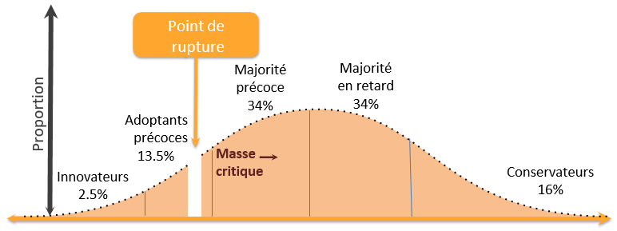

  

<h3>Ma définition ?</h3>

J'utiliserais le <b>cercle d'or</b> (méthode popularisée par <b>Simon Sinek</b>, visant à améliorer la stratégie de communication des entreprises)

	<table>
		  <tr>
			  <td><b>WHY</b></mark></td>
			  <td>Définir un modèle organisationnel visant à aligner les objectifs Business avec ceux de l'IT</td>
		  </tr>
		  <tr>
			  <td><b>HOW</b></td>
			  <td>En augmentant la chaîne de valeur : Personnes / Processus / Automatisation</td>
		  </tr>  
		  <tr>
			  <td><b>WHAT</b></td>
			  <td>En valorisant les méthodologies, framework et outils prônant la collaboration et l'amélioration continue</td>
		  </tr>  
	</table>

<h3>L'historique</h3>

	<table>
		  <tr>
		    <td>2003</td>
			  <td><b>SRE (Site Reliability Engineering)</b> : Poste d'ingénieur créé par Google pour travailler sur la robustesse de l'infrastructure et la haute disponibilité des services. Fondé sur l'idée d'une collaboration plus étroite entre ingénieurs de production et équipe de développement</td>
		  </tr>
		  <tr>
		    <td>2007</td>
		    <td>
			    <ul>
				    <li><b>Patrick Debois</b> initie le terme : DEV-OPS</li>
				    <li><b>Andrew Shafer et Lee Thompson</b> initie le terme : Mur de la confusion</li>
			    </ul>
		    </td>
		  </tr>
		  <tr>
		    <td>2008</td>
	 	    <td><b>Andrew Shafer</b> lance l'idée d'une "Infrastructure Agile" (soutenu par <b>Patrick Debois</b>) ce qui
			donne naissance au groupe de discution Google : <a href="https://groups.google.com/g/agile-system-administration">Agile System Administration</a>    		    
		    </td>
		  </tr>
		  <tr>
		    <td>06/2009</td>
	 	    <td><b>John Allspaw et Paul Hammond</b> relance l'idée lors d'une conférence au Velocity O'Reilly : "10+ Deploys per Day : Dev and Ops Cooperation at Flickr"	    
		    </td>
		  </tr>
		  <tr>
		    <td>10/2009</td>
		    <td><b>Patrick Debois</b> créé les <a href="https://devopsdays.org">DevOps Days</a> et donne naissance au hashtag #DevOps sur Twitter, ce qui légitime le terme
		    </td>
		  </tr>			
	</table>

		   
<h3>Les fondements</h3>

<a href="http://devops.com/2016/03/17/what-devops-is-not/">5 Things DevOps is NOT !</a>

	DevOps est basé sur un <b>CBOK</b> (Collective Body of Knowledge) : référentiel de connaissances partagées et collectives
	<ul>
		<li><b>Conférences</b></li>
		 
		<table>
			  <tr>
				  <td><a href="https://devopsdays.org">DevOps Days</a></td>
				  <td>fondé par Patrick Debois en 2009</td>
			  </tr>
			  <tr>
				  <td><a href="https://events.itrevolution.com">Devops Enterprise Summit</a></td>
				  <td>fondé par Gene Kim en 2014</td>
			  </tr>  
		</table>
		<li><b>Rapports annuels</b></li>
		 
		<table>
			  <tr>
				  <td>Accelerate State of DevOps</td>
				  <td>
					 Publié par l’équipe <b>DORA</b> (DevOps Research & Assessment) de <b>Google Cloud</b> 
					 <ul>
					 <li>Indicateurs de Vélocité</li>
					 <ul>
						 <li>Deployment Frequency: Fréquence à laquelle une organisation réussit à mettre en production</li>
						 <li>Lead Time for Changes: Temps qu'il faut à un commit pour passer en production</li>
					 </ul>
					 </ul>		 
					 <ul>
					 <li>Indicateurs de Stabilité</li>
					 <ul>
						 <li>Change Failure Rate: Pourcentage de déploiements provoquant un échec en production</li>
						 <li>Time to Restore Service (MTTR): Temps nécessaire à une organisation pour se remettre d'une panne de production</li>
					 </ul>
					 </ul>	
				  </td>
			  </tr>
			  <tr>
				  <td>The State of DevOps Report</td>
				  <td>Publié par <b>Puppet</b></td>
			  </tr>
			  <tr>
				  <td>Upskilling IT</td>
				  <td>
					 Publié par le <b>DevOps Institute</b> 
					 <ul>
					 <li>Indicateurs de Compétences</li>
					 <ul>
				  </td>
			  </tr>
		</table>
		<li><b>Ouvrages de référence</b></li>
		 
		<table>
			  <tr>
				  <td>2013</td>
				  <td>The Phoenix Project</td>
				  <td>Gene Kim, Kevin Behr, George Spafford</td>
			  </tr>
			  <tr>
				  <td>2016</td>
				  <td>The Devops Handbook</td>
				  <td>Gene Kim, Jez Humble, Patrick Debois, John Willis</b>
			  </tr>  
		</table>
	</ul>	

	

<h3>Les grands principes</h3>
<ul>
	<li><b><a href="./resources/agile.md">AGILE</a></b>, <b><a href="./resources/lean.md">LEAN</b></a> (gestion organisationelle), <b><a href="./resources/itsm.md">ITSM</a></b> (IT Service Management) </li>
	 
	<li><b>CALMS</b></li>
	 
	
Framework (initié par <b>Jez Humble</b>) permettant d'évaluer la capacité d'une entreprise à adopter les processus DevOps

	<ul>
		<li><b>C</b>ulture: Partage de la vision et des responsabilités entre les différents acteurs</li>
		<li><b>A</b>utomatisation: d'éliminer les tâches manuelles répétitives, exploite des processus reproductibles et crée des systèmes fiables</li>
		<li><b>L</b>ean:</li>
		<li><b>M</b>esure:</li>
		<li><b>S</b>haring: Partage d'informations</li>
	</ul>
	 
	<li><b>THREE WAYS</b></li>
	 
	
Rédigé par <b>Gene Kim</b> dans le livre "The Phoenix Project", décrit une façon de fournir de la valeur à un rythme plus rapide

	<ul>
		<li><u><b>Flux</b></u>: Comprendre et améliorer le flux de travail</li>
		

		
<i>La première voix met l'accent sur la pensée systémique, l'optimisation du processus métier, sa rationalisation et sa fiabilité</i>

		

			<table>
				  <tr>
					  <td><b>Continuous integration</b> (CI)</td>
					  <td>Méthode consistant à intègrer régulièrement les modifications à un référentiel centralisé, à partir duquel sont déclenchées automatiquement les étapes [build] et [test] visant à contrôler : la qualité, la conformité, la non régression...</td>
				  </tr>
				  <tr>
					  <td><b>Continuous Delivery</b> (CD)</td>
					  <td>Acceptation -> <b>Trigger</b> (action manuelle) -> Production</td>
				  </tr>
				  <tr>
					  <td><b>Cotinuous Deployment</b> (CD)</td>
					  <td>Acceptation -> Production</td>
				  </tr>
				  <tr>
					  <td><b>Lean</b></td>
					  <td>Amélioration continue des processus de production</td>
				  </tr>
				  <tr>
					  <td><b>VSM</b> (Value Stream Mapping)</td>
					  <td>
						<b>Cartographie des flux</b> (production/information) visant à identifier:
						<ul>
							<li>les opérations sans valeur ajoutée afin de les supprimer ou de les réduire</li>
							<li>les opportunités d’amélioration</li>
						</ul>	
					  </td>
				  </tr>
				  <tr>
					  <td><b>Kanban</b></td>
					  <td>
						<b>Méthode</b> inventée en 1950 par Taiichi Ohno chez Toyata <b>visant à améliorer le flux de travail</b>:
						<ul>
							<li>flux tendu: <b>tiré par la demande</b>, et non poussée à partir des prévisions</li>
							<li><b>réduction</b> de l'espace, des stocks et du <b>WIP</b> (Work in Progress)</li>
							<li><b>visualisation du travail</b> : dashboard permettant de suivre l'état d'avancement des tâches à accomplir [REQUESTED, IN_PROGRESS, DONE]</li>
							<li><b>mesure la vélocité</b> de l'équipe (quantité de travail par itération)</li>
						</ul>	
					  </td>					  
				  </tr>  
				  <tr>
					  <td><b>Théorie des Contraintes</b> (TOC)</td>
					  <td>Initié par Eliyahu M. Goldratt dans le livre "The Goal" en 1984</td>
				  </tr>  
			</table>
		

		<li><b>Feedback</b>: Créer des boucles de feedback permettant une amélioration continue</li>
		

		
<i>La deuxième voix met l'accent sur l'amélioration continue</i>

		

			<table>
				  <tr>
					  <td><b>Fail Fast</b></td>
					  <td>Méthode d'apprentissage par l'échec</td>
				  </tr>
				  <tr>
					  <td><b>Tests automatisés</b></td>
				  	  <td>
					    	<ul>
							<li><b>Fonctionnels</b> (vérifier la conformité // cahier des charges)</li>
							<ul>
								<li>Tests unitaires</li>
								<li>Tests d'intégration</li>
								<li>Tests du système (homologation)</li>
								<li>Tests d'acceptation (recette)</li>
								<li>Tests IHM</li>
								<li>Tests de non-régression</li>
							</ul>
							<li><b>NON fonctionnels</b></li>
							<ul>
								<li>Tests de performance</li>
								<li>Tests de charge</li>
								<li>Tests de résistance</li>
								<li>Tests de volume</li>
								<li>Tests de sécurité</li>
								<li>Tests d'installation</li>
								<li>Tests de récupération</li>
							</ul>
						</ul>	
					  </td>
				  </tr>
				  <tr>
					  <td><b>Revue par les pairs des changements de production</b></td>
					  <td>???</td>
				  </tr>
				  <tr>
					  <td><b>Pratiques de surveillance et de notification</b></td>
					  <td>???</td>
				  </tr>
				  <tr>
					  <td><b>Tableaux de bord</b></td>
					  <td>???</td>
				  </tr>	
				  <tr>
					  <td><b>Monitoring</b></td>
					  <td>???</td>
				  </tr>
				  <tr>
					  <td><b>Logs</b></td>
					  <td>???</td>
				  </tr>	
				  <tr>
					  <td><b>Mesures/Indicateurs de processus</b></td>
					  <td>???</td>
				  </tr>	
				  <tr>
					  <td><b>Autopsie</b></td>
					  <td>???</td>
				  </tr>	
				  <tr>
					  <td><b>Rotation d'astreinte partagée</b></td>
					  <td>???</td>
				  </tr>	
				  <tr>
					  <td><b>Données</b></td>
					  <td>gestion des changements, des incidents, des problèmes et des connaissances</td>
				  </tr>	
			</table>
		

		<li><b>Expérimentation et apprentissage continus</b></li>
		

		
<i>La troisième voix met l'accent sur la culture et le comportement pour atteindre la maîtrise</i>

		

			<table>
				  <tr>
					  <td><b>PDCA</b> (Deming Cycle)</td>
					  <td>
						Méthodologie itérative permettant d'atteindre la condition cible
						<ul>
							<li><b>Plan</b>: définir les objectifs</li>
							<li><b>Do</b>: exécuter</li>
							<li><b>Check</b>: vérifier les résultats obtenus</li>
							<li><b>Act</b>: évaluer puis réessayez</li>
						</ul>
					  </td>
				  </tr>
				  <tr>
					  <td><b>Improvement Kata</b></td>
				  	  <td>
					    	<ol type="1">
							<li>Comprendre la vision ou l’orientation à long terme</li>
							<li>Analyser l’existant et savoir l'évaluer (Métrics)</li>
						  	<li>Définir un objectif d’amélioration</li>
							<li><b>PDCA*</b> : Expérimenter vers l'objectif</li>
						</ol>	
					  </td>
				  </tr>
				  <tr>
					  <td><b>Andon Cord</b></td>
					  </td></td>	  
				  </tr>	  
				  <tr>
					  <td><b>Hackatons</b></td>
					  <td>???</td>
				  </tr>
				  <tr>
					  <td><b>Chaos Engineering</b></td>
					  <td>
					    	<ul>
							<li><b>Design for failure</b> (DFF) est la capacité d’un système à résister aux pannes</li>
							<table>
								  <tr>
									  <td>Timeout</td>
									  <td>Gérer les délais d'attente</td>
								  </tr>
								  <tr>
									  <td>Retry</td>
									  <td>Gérer l'indisponibilité</td>
								  </tr>
								  <tr>
									  <td>Fallback</td>
									  <td>Assurer une réponse, même "dégradée"</td>
								  </tr>
								  <tr>
									  <td>Circuit Breaker</td>
									  <td>Isoler les défaillances</td>
								  </tr> 
								  <tr>
									  <td>Bulkhead</td>
									  <td>Eviter l'effet domino</td>
								  </tr> 
								  <tr>
									  <td>BackPressure Rate Limiter</td>
									  <td>Gérer la charge</td>
								  </tr> 
							</table>
							<li><b>Simian Army</b> est suite d’outils développés par <b>Netflix</b> pour tester la fiabilité, la sécurité ou la résilience de ses infrastructures (AWS)</li>
							<table>
								  <tr>
									  <td>Choas Monkey</td>
									  <td>1er logiciel conçu en 2011 capable de mettre délibérément hors service des instances dans l’environnement de production</td>
								  </tr>
								  <tr>
									  <td>Chaos Gorilla</td>
									  <td>Logiciel capable de faire tomber une zone complète de disponibilité</td>
								  </tr>
								  <tr>
									  <td>Chaos Kong</td>
									  <td>Logiciel capable de faire tomber une région complète</td>
								  </tr>
								  <tr>
									  <td>Latency Monkey</td>
									  <td>Gestion de la perte de performance (voir de l'indisponibilité) d'un composant externe</td>
								  </tr> 
								  <tr>
									  <td>Doctor Monkey</td>
									  <td>Gestion des instances présentant des risques de santé</td>
								  </tr> 
								  <tr>
									  <td>Janitor Monkey</td>
									  <td>Gestion des instances non utilisées</td>
								  </tr> 
								  <tr>
									  <td>Conformity Monkey</td>
									  <td>Gestion des instances non conformes</td>
								  </tr> 	
								  <tr>
									  <td>Security Monkey</td>
									  <td>Gestion des instances qui présentent des vulnérabilités</td>
								  </tr> 
								  <tr>
									  <td>10–18 Monkey</td>
									  <td>Gestion des instances qui présentent des problèmes de localisation ou de langage (l10n-i18n)</td>
								  </tr> 
							</table>
						</ul>
					  </td>		  
				  </tr>
			</table>
		

	</ul>	
</ul>
<h3>La culture du changement</h3>
<ul>
	<li>La culture ne fait qu’une bouchée de toute stratégie (Peter Drucker)</li>
	<li>Les gens n’offrent pas de résistance au changement mais à être changés (Peter Senge)</li>
</ul>
<ul>
	<li><b>Organisationelle</b></li>
	<ul>
		<li>
<b>Les façons dont les organisations traitent l'information</b> (<b>The Three Cultures Model</b> publié par <b>Ron Westrum</b>)
</li>
		<table>
			<thead>
			<tr>
				<th>Pathologique (Orientée vers le pouvoir)</th>
				<th>Bureaucratique (Orientée vers les règles)</th>
				<th>Génératrice (Orientée vers la performance)</th>
			</tr>
			</thead>
			<tbody>
				<tr>
					<td>Faible coopération</td>
					<td>Coopération modeste</td>
					<td>Grande coopération</td>
				</tr>
				<tr>
					<td>Messagers "abattus"</td>
					<td>Messagers négligés</td>
					<td>Messagers formés</td>
				</tr>
				<tr>
					<td>Responsabilités non assumées</td>
					<td>Responsabilités limitées</td>
					<td>Risques partagés</td>
				</tr>
				<tr>
					<td>Liaison découragée</td>
					<td>Liaison tolérée</td>
					<td>Liaison encouragée</td>
				</tr>
				<tr>
					<td>L'échec conduit à se rejeter la faute</td>
					<td>L'échec conduit au tribunal</td>
					<td>L'échec conduit à une enquête</td>
				</tr>
				<tr>
					<td>La nouveauté est écrasée</td>
					<td>La nouveauté crée des problèmes</td>
					<td>La nouveauté est mise en œuvre</td>
				</tr>
				<tr>
					<td><b>L’échec est souvent caché</b></td>
					<td><b>L’échec est traité par un système de jugements, qui entraîne soit la punition ou l’acquitement</b></td>
					<td><b>L’échec entraîne une véritable interrogation, une réflexion</b></td>
			</tbody>
		</table>
		<li>
<b>Le temps d'adoption des nouvelles idées</b> (<b>Diffusion of innovations</b> publié par <b>Everett Rogers</b>)
</li>
		
		<table>
			<tr>
				<th colspan=2 align="left">Les 5 phases de l’adoption</th>
			</tr>
			<tr>
				<td><b>Connaissance</b></td>
				<td>L’individu est exposé à l’innovation, il réagit en fonction de son profil personnel et du système social dans lequel il évolue</td>
			</tr>
			<tr>
				<td><b>PERSUASION</b></td>
				<td>
					Etape cruciale, l’individu amorce une prise de position au sujet de l’innovation suivant <b>5 critères d'évaluation</b>:
					<ul>
						<li>son avantage relatif</li>
						<li>sa compatibilité avec les valeurs du groupe d’appartenance</li>
						<li>sa complexité</li>
						<li>la possibilité de la tester</li>
						<li>sa visibilité pour montrer les résultats aux autres</li>
					</ul>	
				</td>
			</tr>
			<tr>
				<td><b>Décision</b></td>
				<td>L’individu s’engage dans des activités d’utilisation/évaluation, lui permettant d’adopter ou de rejeter l’innovation</td>
			</tr>	
			<tr>
				<td><b>Implantation</b></td>
				<td>L’individu a besoin d’assistance pour réduire les incertitudes sur les conséquences</td>
			</tr>	
			<tr>
				<td><b>Confirmation</b></td>
				<td>L’individu tente d’obtenir des informations venant, a posteriori, renforcer son choix</td>
			</tr>	
		</table>
		<li>
<b>La courbe de changement "5 étapes clés"(</b> publiée par <b>Elisabeth Kübler-Ross</b> (adaptée au monde de l’entreprise par <b>Cynthia Scott et Denis Jaffe</b>)
</li>
		 
		
	</ul>
</ul>
