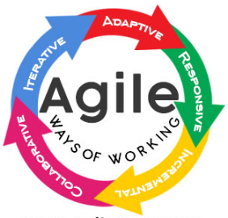
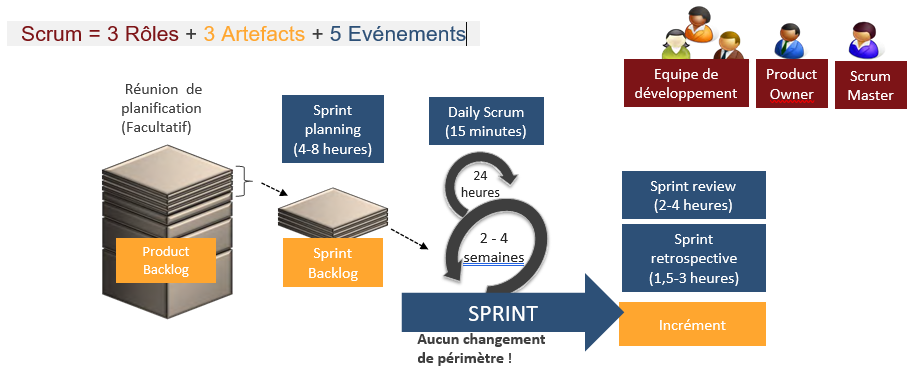

<table>
	<tr>
		<td></td>
		<td>Approche itérative régie par le <b>Manifeste Agile</b> rédigé en 2001</td>
	</tr>
</table>	
<ul>
	<li><b>4 valeurs</b></li>
	 
	<table>
		  <tr>
			  <td>1.</td>
			  <td>Les individus et leurs interactions <b>plutôt</b> que les processus et les outils</td>
		  </tr>
		  <tr>
			  <td>2.</td>
			  <td>Un logiciel fonctionnel <b>plutôt</b> qu’une documentation exhaustive</td>
		  </tr>
		  <tr>
			  <td>3.</td>
			  <td>Une collaboration avec les clients <b>plutôt</b> qu'une négociation contractuelle</td>
		  </tr>
		  <tr>
			  <td>4.</td>
			  <td>Une adaptation au changement <b>plutôt</b> qu'à l'exécution d’un plan</td>
		  </tr>
	</table>
	<li><b>12 principes</b></li>
	 
	<table>	
		  <tr>
			  <td>1.</td>
			  <td>Prioriser la satisfaction du client</td>
		  </tr>
		  <tr>
			  <td>2.</td>
			  <td>Accepter les changements</td>
		  </tr>
		  <tr>
			  <td>3.</td>
			  <td>Livrer en permanence des versions opérationnelles de l’application</td>
		  </tr>
		  <tr>
			  <td>4.</td>
			  <td>Assurer le plus souvent possible une coopération entre l’équipe et les gens du métier</td>
		  </tr>
		  <tr>
			  <td>5.</td>
			  <td>Construire les projets autour de personnes motivées</td>
		  </tr>
		  <tr>
			  <td>6.</td>
			  <td>Favoriser le dialogue direct</td>
		  </tr>	
		  <tr>
			  <td>7.</td>
			  <td>Mesurer l’avancement du projet en fonction de l’opérationnalité du produit</td>
		  </tr>	
		  <tr>
			  <td>8.</td>
			  <td>Adopter un rythme constant et soutenable par tous les intervenants du projet</td>
		  </tr>	
		  <tr>
			  <td>9.</td>
			  <td>Contrôler continuellement l’excellence de la conception et la bonne qualité technique</td>
		  </tr>	
		  <tr>
			  <td>10.</td>
			  <td>Privilégier la simplicité en évitant le travail inutile</td>
		  </tr>	
		  <tr>
			  <td>11.</td>
			  <td>Auto-organiser et responsabiliser les équipes</td>
		  </tr>	
		  <tr>
			  <td>12.</td>
			  <td>Améliorer régulièrement l’efficacité de l’équipe en ajustant son comportement</td>
		  </tr>				
	</table>
	<li><b>Les Frameworks</b></li>
	 
	<ul>
		<li><b><a href="../docs/2020-scrum-guide.pdf">Scrum</a></b></li>
		 
		
Framework créé en 1990 par <b>Ken Schwaber & Jeff Sutherland</b> (et publié en 2010) définissantun <b>"cadre de travail"</b>

		
	</ul>
	<table>
		  <tr>
			  <td>eXtreme Programming</td>
			  <td>Publié en 1999 par <b>Kent Beck</b></td>
		  </tr>
		  <tr>
			  <td>SAFe</td>
			  <td>Lancé en 2011 par <b>Dean Leffingwell et Drew Jemilo</b>  
			      <i>Scaled Agile Framework</i> est un ensemble de modèles d'organisation et de workflow pour l'implémentation des pratiques Agile à l'échelle de l'entreprise</td>
		  </tr>
	</table>	
</ul>
