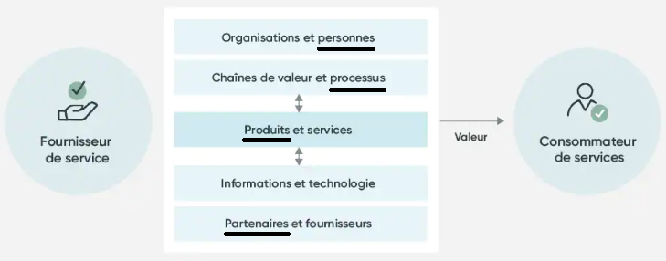
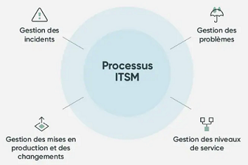
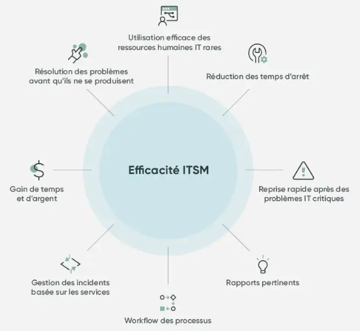

<table>
	<tr>
		<td></td>
		<td>Approche stratégique décrivant les processus et les outils permettant de fournir l'<b>IT en tant que service</b></td>
	</tr>
</table>
<ul>
	<li><b>4 secteurs</b> (dits les quatre P):</li>
		 
		
	 
	<li><b>Processus</b></li>
		 
		
	 
	<li><b>Gains d’efficacité</b></li>
		 
			
</ul>
