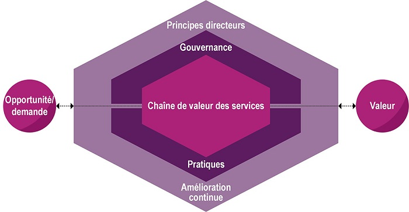

<table>
	<tr>
		<td></td>
		<td>
			
<b>Approche stratégique</b> visant à fournir l'<b>IT en tant que service</b>

			
Elle définie la façon dont les entreprises créent, conçoivent, fournissent, gèrent et assurent le support des services (<b>Cycle de vie</b>)
</td>
	</tr>
</table>
<ul>
	<li><b>ITIL 4</b> (IT Infrastructure Library), référentiel méthodologique qui aide à gérer les services IT au sein de l’entreprise</li>
	 
	<ul>
		<li><b>4 Dimensions model</b> (remplace les <b>4P : Personnes, Produits, Partenaires et Processus</b>)</li>
		 
		

			
		

		<li><b>Service Value System</b> (SVS), représente la manière dont tous les composants et activités d'une organisation travaillent ensemble</li>
		 
		

			
		

		<li><b>Service Value Chain</b> (SVC), décrit les activités clés requises pour répondre à la demande</li>
		 
		

			
		

		<li><b>34 practices</b> into <b>3 categories</b> (remplace les <b>Processus</b>)</li>
		 
		

			
		

	<li>Chaque <b>Activité</b> (<b>Processus</b>) doit avoir les <b>caractéristiques</b> suivantes :</li>
		 
		<ul>
			<li>Etre mesurable</li>
			<li>Fournir un résultat spécifique</li>
			<li>Créer une valeur pour le client</li>
			<li>Répondre à un événement spécifique (expl: l'appel d'un utilisateur à la hotline)</li>
		</ul>
	</ul
</ul>
