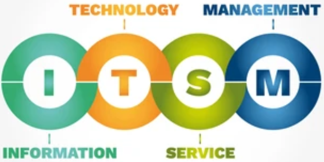

<table>
	<tr>
		<td></td>
		<td>
			
<b>Approche stratégique</b> visant à fournir l'<b>IT en tant que service</b>

			
Elle définie la façon dont les entreprises créent, conçoivent, fournissent, gèrent et assurent le support des services (cycle de vie)
</td>
	</tr>
</table>
<ul>
	<li><b>4 secteurs</b> (dits les quatre P):</li>
		 
		
		

	<li><b>Axé sur les Processus</b> (Ensemble d'activités coordonnées combinant des ressources et des aptitudes)</li>
		 
		<ul>
			<li>gestion des demandes</li>		
			<li>gestion des incidents</li>
			<li>gestion des problèmes</li>
			<li>gestion des changements et des mises en production</li>
			<li>gestion des niveaux de service</li>
			<li>gestion de la configuration</li>
			<li>gestion de l’amélioration continue</li>
			<li>gestion des workflows et des talents</li>
		</ul>
		 
	<li><b>Gains</b></li>
		 
		<ul>
			<li>Utilisation efficace de ressources IT (limitées)</li>
			<li>Workflow des processus</li>
			<li>Gain de temps et d'argent</li>
			<li>Prévention des problèmes avant leur survenue</li>
			<li>Rapports fréquents et pertinents</li>
			<li>Gestion des incidents basée sur les services</li>
			<li>Retour rapide à la normale après des problèmes IT critiques</li>
		</ul>
		 
	<li><b>ITL</b> (IT Infrastructure Library)</li>
	 
	
<b>Référentiel méthodologique</b> qui aide à gérer les services IT au sein de l’entreprise

	<ul>
		<li><b>Modèle à 4 dimensions</b> (reflète les <b>4P : Personnes, Produits, Partenaires et Processus</b>)</li>
	</ul
	<li>un <b>cadre de travail</b></li>,
</ul>

		
Un processus ITIL doit donc avoir les caractéristiques suivantes :

		<ul>
			<li>Etre mesurable</li>
			<li>Fournir un résultat spécifique</li>
			<li>Créer une valeur pour le client</li>
			<li>Répondre à un événement spécifique (expl: l'appel d'un utilisateur à la hotline)</li>
		</ul>
