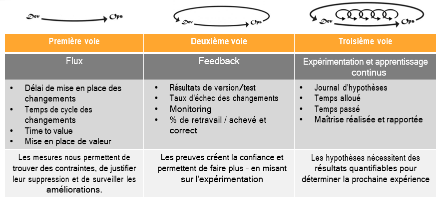
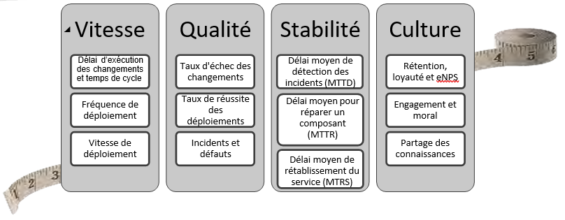

  

<h3>Les indicateurs</h3>
<ul>
	<li><i>Si vous ne pouvez pas le mesurer vous ne pouvez pas l’améliorer</i> (<b>Peter Drucker</b>)</li>
</ul>

 
<table>
	<th colspan="2">Satisfaction client / utilisateur</th>
	<tr>
		<th align="left">Nbr Tickets</th>
		<td>Remontées utilisateur ou client</td>	
	</tr>
	<tr>
		<th align="left">Taux d'utilisation</th>
		<td>Nombre de connexion, volume de transactions...</td>	
	</tr>
	<th colspan="2">Productivité</th>
	<tr>
		<th align="left">TTV</th>
		<td><b>Time To Value</b> Rapidité avec laquelle vos clients tirent profit de vos produits</td>	
	</tr>
	<tr>
		<th align="left">TTM</th>
		<td><b>Time To Market</b> Temps entre l’expression d’un besoin et la mise en production de la solution associée</td>
	</tr>
	<tr>
		<th align="left">TTDelivery</th>
		<td><b>Time to Delivery</b> Temps pour mettre en production la modification d'une seule ligne de code</td>	
	</tr>
	<tr>
		<th align="left">TTDeploy</th>
		<td><b>Time to Deploy</b> Temps pour déployer un applicatif</td>	
	</tr>
	<th colspan="2">Vélocité</th>
	<tr>
		<td colspan="2" align="center">Volume de travail effectué dans un intervalle de temps défini</td>	
	</tr>
	<tr>
		<th align="left">Lead Time</th>
		<td>
			<b>Délai de mise en place</b> 
			Temps total écoulé entre le moment où une User Story entre dans le Backlog et sa livraison (y compris le temps d'attente dans le backlog)
		</td>	
	</tr>
	<tr>
		<th align="left">Cycle Time</th>
		<td>
			<b>Temps de réalisation</b> 
			Temps qu'il faut pour qu'une User Story passe de «En cours» à «Fait»
		</td>	
	</tr>
	<tr>
		<th align="left">Temps d'attente</th>
		<td>Lead Time - Cycle Time</td>	
	</tr>
	<th colspan="2">Qualité</th>
	<tr>
		<th align="left">MTBF</th>
		<td><b>Mean Time Between Failure</b> Temps qui s'écoule entre deux incidents</td>	
	</tr>
	<tr>
		<th align="left">MTTR</th>
		<td><b>Mean Time To Recovery</b> Temps pour réparer un incident</td>	
	</tr>
	<tr>
		<th align="left">TTDiagnose</th>
		<td><b>Time To Diagnose</b> Temps pour repérer la root cause de l'incident</td>	
	</tr>
	<tr>
		<th align="left">TTRollback</th>
		<td><b>Time to Rollback</b> Temps pour revenir à la version précédente</td>	
	</tr>
	<tr>
		<th align="left">Nbr de builds échoués</th>
		<td>Permet d'estimer la qualité d'un livrable qui va devoir être déployé en production</td>	
	</tr>
	<tr>
		<th align="left">Dette technique</th>
		<td>Synonyme de complexité, de temps de développement et de test allongés, d'incidents de production...</td>	
	</tr>
</table>
 
<strong>Pyramide des indicateurs DevOps de Gartner ???<strong>
