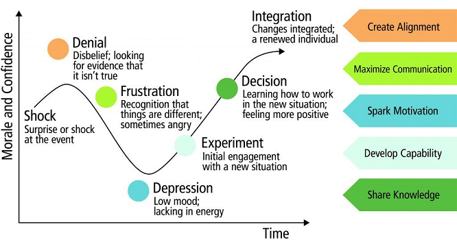
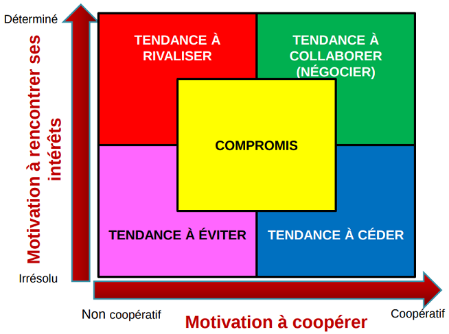

  

<h3>La Toolchains</h3>
<ul>
	<li><b>Periodic table of DevOps Tools</b></li>
	<ul>
		<li>
<b>Les façons dont les organisations traitent l'information</b> (<b>The Three Cultures Model</b> publié par <b>Ron Westrum</b>)
</li>
		<table>
			<thead>
			<tr>
				<th>Pathologique (Orientée vers le pouvoir)</th>
				<th>Bureaucratique (Orientée vers les règles)</th>
				<th>Génératrice (Orientée vers la performance)</th>
			</tr>
			</thead>
			<tbody>
				<tr>
					<td>Faible coopération</td>
					<td>Coopération modeste</td>
					<td>Grande coopération</td>
				</tr>
				<tr>
					<td>Messagers "abattus"</td>
					<td>Messagers négligés</td>
					<td>Messagers formés</td>
				</tr>
				<tr>
					<td>Responsabilités non assumées</td>
					<td>Responsabilités limitées</td>
					<td>Risques partagés</td>
				</tr>
				<tr>
					<td>Liaison découragée</td>
					<td>Liaison tolérée</td>
					<td>Liaison encouragée</td>
				</tr>
				<tr>
					<td>L'échec conduit à se rejeter la faute</td>
					<td>L'échec conduit au tribunal</td>
					<td>L'échec conduit à une enquête</td>
				</tr>
				<tr>
					<td>La nouveauté est écrasée</td>
					<td>La nouveauté crée des problèmes</td>
					<td>La nouveauté est mise en œuvre</td>
				</tr>
				<tr>
					<td><b>L’échec est souvent caché</b></td>
					<td><b>L’échec est traité par un système de jugements, qui entraîne soit la punition ou l’acquitement</b></td>
					<td><b>L’échec entraîne une véritable interrogation, une réflexion</b></td>
			</tbody>
		</table>
		<li>
<b>Le temps d'adoption des nouvelles idées</b> (<b>Diffusion of innovations</b> publié par <b>Everett Rogers</b>)
</li>
		
		<table>
			<tr>
				<th colspan=2 align="left">Les 5 phases de l’adoption</th>
			</tr>
			<tr>
				<td><b>Connaissance</b></td>
				<td>L’individu est exposé à l’innovation, il réagit en fonction de son profil personnel et du système social dans lequel il évolue</td>
			</tr>
			<tr>
				<td><b>PERSUASION</b></td>
				<td>
					Etape cruciale, l’individu amorce une prise de position au sujet de l’innovation suivant <b>5 critères d'évaluation</b>:
					<ul>
						<li>son avantage relatif</li>
						<li>sa compatibilité avec les valeurs du groupe d’appartenance</li>
						<li>sa complexité</li>
						<li>la possibilité de la tester</li>
						<li>sa visibilité pour montrer les résultats aux autres</li>
					</ul>	
				</td>
			</tr>
			<tr>
				<td><b>Décision</b></td>
				<td>L’individu s’engage dans des activités d’utilisation/évaluation, lui permettant d’adopter ou de rejeter l’innovation</td>
			</tr>	
			<tr>
				<td><b>Implantation</b></td>
				<td>L’individu a besoin d’assistance pour réduire les incertitudes sur les conséquences</td>
			</tr>	
			<tr>
				<td><b>Confirmation</b></td>
				<td>L’individu tente d’obtenir des informations venant, a posteriori, renforcer son choix</td>
			</tr>	
		</table>
		<li>
<b>La courbe de changement "5 étapes clés"</b> (publiée par <b>Elisabeth Kübler-Ross</b>)
</li>
		
	</ul>
	<li><b>Collaborative</b> (basé sur la communication)</li>
	 
	<ul>
		<li><b>La gestion des conflits</b> (THI) publié par (<b>Thomas-Kilmann</b>)</li>
		 
		
		<table>
			<tr>
				<th colspan=3 align="left">Les 5 styles de gestion</th>
			</tr>
			<tr>
				<th align="left"><b><i>Mode</i></b></th>
				<th align="left"><b></i>Approche</i></b></th>
				<th align="left"><b></i>Résultat</i></b></th>
			</tr>
			<tr>
				<td>Rivaliser</td>
				<td>Assertif et NON coopératif</td>
				<td>Je gagne / Tu perds</td>
			</tr>
			<tr>
				<td>Collaborer</td>
				<td>Assertif et coopératif</td>
				<td>Je gagne / Tu gagnes</td>
			</tr>
			<tr>
				<td>Chercher un compromis</td>
				<td>Partiellement assertif et coopératif</td>
				<td>Je gagne un peu / Tu gagnes un peu</td>
			</tr>
			<tr>
				<td>Eviter</td>
				<td>NON assertif et NON coopératif</td>
				<td>Je perds / Tu perds</td>
			</tr>
			<tr>
				<td>Céder</td>
				<td>NON assertif et NON coopératif</td>
				<td>Je perds / Tu gagnes</td>
			</tr>
			<tr>
				<td colspan=3>
					<b>Assertif</b>*: Capacité à s’exprimer et à défendre ses idées sans empiéter sur celles d'autrui 
					<b>Coopératif</b>*: Participe volontiers à un effort commun 
				</td>
			</tr>
		</table>
		<li><b>La fatigue face aux changements</b></li>
	</ul>	
</ul>
